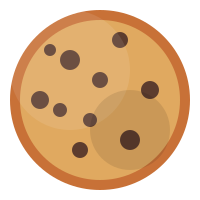

# [クッキークリッカー (Cookie Clicker Clone)](https://clicker-game-clone-nine.vercel.app/)

## 概要

このプロジェクトは人気ゲーム「Cookie Clicker」の最低限の機能を実装したクローンゲームです。オリジナルの基本的な要素を再現しつつ、シンプルな実装になっています。

## 機能

- **クッキークリック**: クッキーをクリックしてスコアを増やす基本機能
- **アップグレード**: 3種類の基本アップグレード（カーソル、グランマ、ファーム）
- **セーブ機能**: ローカルストレージを使用したゲーム進行の保存と読み込み
- **リセット機能**: ゲームを初期状態に戻す機能
- **クリックアニメーション**: クリック時の視覚的フィードバック
- **クリック音**: クリック時のサウンドフィードバック

## 遊び方

1. クッキーをクリックしてスコアを増やす
2. 十分なスコアが貯まったらアップグレードを購入
3. アップグレードによりクリック当たりの価値が上昇
4. より多くのクッキーを集めてさらにアップグレード

## 技術的詳細

- **HTML/CSS/JavaScript**: 純粋なフロントエンド技術のみで実装
- **localStorage API**: ゲームの進行状況を保存するために使用
- **レスポンシブデザイン**: 様々な画面サイズに対応

## 制限事項

このゲームは最低限の機能のみを実装したクローンであり、オリジナルの「Cookie Clicker」と比較して以下の制限があります：

- 自動生産機能は実装されていない
- 実績システムは含まれていない
- 多様なアップグレードやビルディングが少ない
- 特殊イベントやゴールデンクッキーなどの追加要素がない

## 将来の拡張可能性

- 自動生産機能の追加
- より多くのアップグレードタイプ
- 実績システムの実装
- 統計情報の表示
- ゴールデンクッキーなどの特殊イベント

## クレジット

このプロジェクトは学習目的で作成された「Cookie Clicker」のクローンゲームです。オリジナルの「Cookie Clicker」は[Orteil](https://orteil.dashnet.org/cookieclicker/)によって開発されています。
